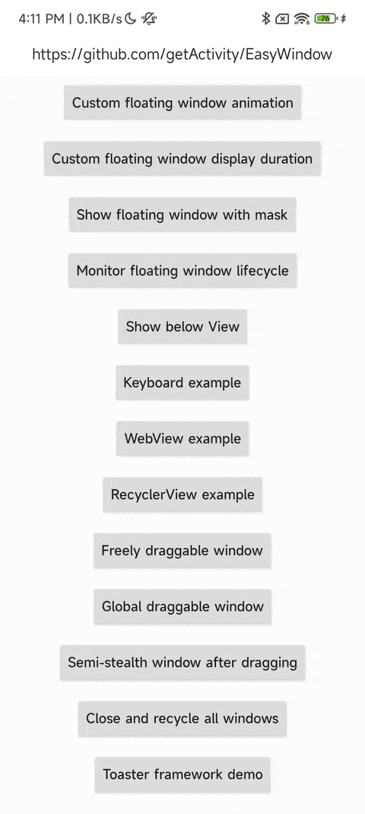

# [中文文档](README.md)

# Floating window framework

* Project address: [Github](https://github.com/getActivity/EasyWindow)

* [Click here to download demo apk directly](https://github.com/getActivity/EasyWindow/releases/download/13.2/EasyWindow.apk)



#### This framework is intended to solve some floating window requirements. If it is a normal Toast package, it is recommended to use [Toaster](https://github.com/getActivity/Toaster)

#### Integration steps

* If your project Gradle configuration is in `7.0` below, needs to be in `build.gradle` file added

```groovy
allprojects {
    repositories {
        // JitPack remote repository：https://jitpack.io
        maven { url 'https://jitpack.io' }
    }
}
```

* If your Gradle configuration is `7.0` or above, needs to be in `settings.gradle` file added

```groovy
dependencyResolutionManagement {
    repositories {
        // JitPack remote repository：https://jitpack.io
        maven { url 'https://jitpack.io' }
    }
}
```

* After configuring the remote warehouse, under the project app module `build.gradle` Add remote dependencies to the file

```groovy
android {
    // Support JDK 1.8
    compileOptions {
        targetCompatibility JavaVersion.VERSION_1_8
        sourceCompatibility JavaVersion.VERSION_1_8
    }
}

dependencies {
    // Floating window framework：https://github.com/getActivity/EasyWindow
    implementation 'com.github.getActivity:EasyWindow:13.2'
}
```

#### Support library compatible

* If the project is based on **AndroidX** package, please in the item `gradle.properties` file added, if you have already joined, you can ignore it

```text
# Indicates the use of AndroidX
android.useAndroidX = true
# Indicates migration of third-party libraries to AndroidX
android.enableJetifier = true
```

* If the project is based on **Support** Packages do not need to be added to this configuration

#### Use Cases

* Java Usage

```java
// Pass an Activity object to create a local floating window (no overlay permission needed)
// Pass an Application object to create a global floating window (overlay permission required)
EasyWindow.with(this)
        .setContentView(R.layout.toast_hint)
        // Make the window draggable
        //.setWindowDraggableRule()
        // Set display duration
        .setWindowDuration(1000)
        // Set animation style
        //.setWindowAnim(android.R.style.Animation_Translucent)
        // Whether the outside area can be touched
        //.setOutsideTouchable(false)
        // Set background dim amount
        //.setBackgroundDimAmount(0.5f)
        .setImageDrawableByImageView(android.R.id.icon, R.mipmap.ic_dialog_tip_finish)
        .setTextByTextView(android.R.id.message, "Tap me to dismiss")
        .setOnClickListenerByView(android.R.id.message, new OnWindowViewClickListener<TextView>() {

            @Override
            public void onClick(@NonNull EasyWindow<?> easyWindow, @NonNull TextView view) {
                easyWindow.cancel();
                // Navigate to a specific Activity
                // easyWindow.startActivity(intent);
            }
        })
        .show();
```

* Kotlin usage (choose one)

```kotlin
EasyWindow.with(activity).apply {
    setContentView(R.layout.toast_hint)
    // Make the window draggable
    //setWindowDraggableRule()
    // Set display duration
    setWindowDuration(1000)
    // Set animation style
    //setWindowAnim(android.R.style.Animation_Translucent)
    // Whether the outside area can be touched
    //setOutsideTouchable(false)
    // Set background dim amount
    //setBackgroundDimAmount(0.5f)
    setImageDrawableByImageView(android.R.id.icon, R.mipmap.ic_dialog_tip_finish)
    setTextByTextView(android.R.id.message, "Tap me to dismiss")
    setOnClickListenerByView(android.R.id.message, OnWindowViewClickListener<TextView?> { easyWindow: EasyWindow<*>, view: TextView ->
        easyWindow.cancel()
        // Navigate to a specific Activity
        // easyWindow.startActivity(intent)
    })
}.show()
```

```kotlin
EasyWindow.with(activity)
        .setContentView(R.layout.toast_hint)
        // Make the window draggable
        //.setWindowDraggableRule()
        // Set display duration
        .setWindowDuration(1000)
        // Set animation style
        //.setWindowAnim(android.R.style.Animation_Translucent)
        // Whether the outside area can be touched
        //.setOutsideTouchable(false)
        // Set background dim amount
        //.setBackgroundDimAmount(0.5f)
        .setImageDrawableByImageView(android.R.id.icon, R.mipmap.ic_dialog_tip_finish)
        .setTextByTextView(android.R.id.message, "Tap me to dismiss")
        .setOnClickListenerByView(android.R.id.message, OnWindowViewClickListener<TextView?> { easyWindow: EasyWindow<*>, view: TextView ->
            easyWindow.cancel()
            // Navigate to a specific Activity
            // easyWindow.startActivity(intent)
        })
        .show()
```

#### How to display globally without floating window permission?

* Without floating window permission, it cannot be displayed globally on other applications, but it can be displayed globally on your own application.

* However, the floating window created by the current Activity can only be displayed on the current Activity. If you want to display it in all Activities, you need to do special processing.

* We can use Application to monitor all Activity lifecycle methods, and then create a floating window in each Activity.onCreate

```java
public final class WindowLifecycleControl implements Application.ActivityLifecycleCallbacks {

    static void with(Application application) {
        application.registerActivityLifecycleCallbacks(new FloatingLifecycle());
    }

    @Override
    public void onActivityCreated(Activity activity, Bundle savedInstanceState) {
        EasyWindow.with(activity)
                .setContentView(R.layout.xxx)
                .show();
    }

    ......
}
```

#### Framework API Introduction

* Object Methods

```java
// Show the floating window
easyWindow.show();
// Show the floating window with a delay (can be called from a background thread, safe for frequent calls)
easyWindow.delayShow();
easyWindow.delayShow(long delayMillis);
// Show the floating window next to the specified view
easyWindow.showAsDropDown(@NonNull View anchorView, int showGravity, int xOff, int yOff);
// Cancel the floating window
easyWindow.cancel();
// Cancel the floating window with a delay (can be called from a background thread, safe for frequent calls)
easyWindow.delayCancel();
easyWindow.delayCancel(long delayMillis);
// Cancel and recycle the floating window
easyWindow.recycle();
// Recycle the floating window with a delay (can be called from a background thread, safe for frequent calls)
easyWindow.delayRecycle();
easyWindow.delayRecycle(long delayMillis);
// Update the floating window (only needed after modifying its parameters)
easyWindow.update();
// Update the floating window with a delay (can be called from a background thread, safe for frequent calls)
easyWindow.delayUpdate();
easyWindow.delayUpdate(long delayMillis);
// Check if the floating window is currently showing
easyWindow.isShowing();

// Set a lifecycle callback for the window
easyWindow.setOnWindowLifecycleCallback(@Nullable OnWindowLifecycleCallback callback);
// Set the drag rule for the floating window (two built-in rules available: MovingWindowDraggableRule and SpringBackWindowDraggableRule)
easyWindow.setWindowDraggableRule(@Nullable AbstractWindowDraggableRule draggableRule);
// Get the drag rule (could be null)
easyWindow.getWindowDraggableRule();

// Set the content layout of the floating window
easyWindow.setContentView(@LayoutRes int layoutId);
easyWindow.setContentView(@LayoutRes int layoutId, @Nullable OnWindowLayoutInflateListener listener);
easyWindow.setContentView(@NonNull View view);
// Get the content layout (could be null)
easyWindow.getContentView();
// Set the display duration for the floating window
easyWindow.setWindowDuration(@IntRange(from = 0) int delayMillis);
// Set the tag of the floating window
easyWindow.setWindowTag(@Nullable String tag);
// Get the tag of the floating window
easyWindow.getWindowTag();
// Set width and height of the floating window
easyWindow.setWindowSize(int width, int height);
// Set window size by screen percentage
easyWindow.setWindowSizePercent(@FloatRange(from = 0, to = 1) float widthPercent, @FloatRange(from = 0, to = 1) float heightPercent);

// Set the position of the floating window
easyWindow.setWindowLocation(@Px int x, @Px int y);
easyWindow.setWindowLocation(@GravityFlag int gravity, @Px int x, @Px int y);
// Set position by screen percentage offset
easyWindow.setWindowLocationPercent(@FloatRange(from = 0, to = 1) @Px float horizontalPercent, @FloatRange(from = 0, to = 1) @Px float verticalPercent);
easyWindow.setWindowLocationPercent(@GravityFlag int gravity, @FloatRange(from = 0, to = 1) @Px float horizontalPercent, @FloatRange(from = 0, to = 1) @Px float verticalPercent);

// Set whether the outside of the floating window is touchable
easyWindow.setOutsideTouchable(boolean touchable);
// Set background dim amount for the floating window
easyWindow.setBackgroundDimAmount(@FloatRange(from = 0.0, to = 1.0) float amount);

// Add window flags
easyWindow.addWindowFlags(int flags);
// Remove window flags
easyWindow.removeWindowFlags(int flags);
// Set window flags
easyWindow.setWindowFlags(int flags);
// Check if a specific window flag is set
easyWindow.hasWindowFlags(int flags);
// Set the window type
easyWindow.setWindowType(int type);

// Set animation style for the floating window
easyWindow.setWindowAnim(int id);
// Set input mode for soft keyboard
easyWindow.setSoftInputMode(int softInputMode);
// Set window token
easyWindow.setWindowToken(@Nullable IBinder token);

// Set window transparency
easyWindow.setWindowAlpha(@FloatRange(from = 0.0, to = 1.0) float alpha);
// Set vertical margin between container and widget
easyWindow.setVerticalMargin(float verticalMargin);
// Set horizontal margin between container and widget
easyWindow.setHorizontalMargin(float horizontalMargin);
// Set bitmap format
easyWindow.setBitmapFormat(int format);
// Set system UI visibility (status bar, etc.)
easyWindow.setSystemUiVisibility(int systemUiVisibility);
// Set vertical weight
easyWindow.setVerticalWeight(float verticalWeight);
// Set display mode for cutout (notch) screens
easyWindow.setLayoutInDisplayCutoutMode(int layoutInDisplayCutoutMode);
// Specify which display to show the floating window on
easyWindow.setPreferredDisplayModeId(int preferredDisplayModeId);
// Set the window title
easyWindow.setWindowTitle(@Nullable CharSequence title);
// Set screen brightness
easyWindow.setScreenBrightness(@FloatRange(from = -1.0, to = 1.0) float screenBrightness);
// Set button backlight brightness
easyWindow.setButtonBrightness(@FloatRange(from = -1.0, to = 1.0) float buttonBrightness);
// Set preferred refresh rate
easyWindow.setPreferredRefreshRate(float preferredRefreshRate);
// Set color mode
easyWindow.setColorMode(int colorMode);
// Set blur radius behind the window (supported on Android 12+)
easyWindow.setBlurBehindRadius(@IntRange(from = 0) int blurBehindRadius);
// Set screen orientation for the floating window
easyWindow.setScreenOrientation(int screenOrientation);

// Set the visibility of the window view
easyWindow.setWindowViewVisibility(int visibility);
// Get the visibility of the window view
easyWindow.getWindowViewVisibility();
// Set the root layout for the floating window (generally use {@link #setContentView} instead)
easyWindow.setRootLayout(@NonNull ViewGroup viewGroup);
// Reset the WindowManager parameters
easyWindow.setWindowParams(@NonNull WindowManager.LayoutParams params);
// Reset the WindowManager instance
easyWindow.setWindowManager(@NonNull WindowManager windowManager);

// Get the current window view width
easyWindow.getWindowViewWidth();
// Get the current window view height
easyWindow.getWindowViewHeight();

// Set visibility for a specific view by ID
easyWindow.setVisibilityByView(@IdRes int viewId, int visibility);
// Set background drawable for a view
easyWindow.setBackgroundDrawableByView(@IdRes int viewId, @DrawableRes int drawableId);
easyWindow.setBackgroundDrawableByView(@IdRes int viewId, @Nullable Drawable drawable);
// Set text for a TextView
easyWindow.setTextByTextView(@IdRes int viewId, @StringRes int stringId);
easyWindow.setTextByTextView(@IdRes int viewId, @Nullable CharSequence text);
// Set text color for a TextView
easyWindow.setTextColorByTextView(@IdRes int viewId, @ColorInt int colorValue);
// Set text size for a TextView
easyWindow.setTextSizeByTextView(@IdRes int viewId, float textSize);
easyWindow.setTextSizeByTextView(@IdRes int viewId, int unit, float textSize);
// Set hint text for a TextView
easyWindow.setHintTextByTextView(@IdRes int viewId, @StringRes int stringId);
easyWindow.setHintTextByTextView(@IdRes int viewId, @Nullable CharSequence text);
// Set hint text color for a TextView
easyWindow.setHintTextColorByTextView(@IdRes int viewId, @ColorInt int colorValue);
// Set image drawable for an ImageView
easyWindow.setImageDrawableByImageView(@IdRes int viewId, @DrawableRes int drawableId);
easyWindow.setImageDrawableByImageView(@IdRes int viewId, @Nullable Drawable drawable);

// Set click listener (defaults to root layout if view not specified)
easyWindow.setOnClickListener(@Nullable OnWindowViewClickListener<? extends View> listener);
easyWindow.setOnClickListenerByView(@IdRes int id, @Nullable OnWindowViewClickListener<? extends View> listener);
// Set long-click listener (defaults to root layout if view not specified)
easyWindow.setOnLongClickListener(@Nullable OnWindowViewLongClickListener<? extends View> listener);
easyWindow.setOnLongClickListenerByView(@IdRes int id, @Nullable OnWindowViewLongClickListener<? extends View> listener);
// Set touch listener (defaults to root layout if view not specified)
easyWindow.setOnTouchListener(@Nullable OnWindowViewTouchListener<? extends View> listener);
easyWindow.setOnTouchListenerByView(@IdRes int id, @Nullable OnWindowViewTouchListener<? extends View> listener);
// Set key listener (defaults to root layout if view not specified)
easyWindow.setOnKeyListener(@Nullable OnWindowViewKeyListener<? extends View> listener);
easyWindow.setOnKeyListenerByView(@IdRes int id, @Nullable OnWindowViewKeyListener<? extends View> listener);

// Launch an Activity
easyWindow.startActivity(@Nullable Class<? extends Activity> clazz);
easyWindow.startActivity(@Nullable Intent intent);

// Post a task
easyWindow.sendTask(Runnable runnable);
// Post a delayed task
easyWindow.sendTask(@NonNull Runnable runnable, long delayMillis);
// Remove a specific task
easyWindow.cancelTask(@NonNull Runnable runnable);
// Remove all tasks
easyWindow.cancelAllTask();
```

* Static methods

```java
// Cancel all currently displayed floating windows
EasyWindowManager.cancelAllWindow();
// Cancel floating windows by specific class
EasyWindowManager.cancelWindowByClass(@Nullable Class<? extends EasyWindow<?>> clazz);
// Cancel floating windows by specific tag
EasyWindowManager.cancelWindowByTag(@Nullable String tag);

// Show all previously cancelled but not recycled floating windows
EasyWindowManager.showAllWindow();
// Show cancelled but not recycled floating windows by specific class
EasyWindowManager.showWindowByClass(@Nullable Class<? extends EasyWindow<?>> clazz);
// Show cancelled but not recycled floating windows by specific tag
EasyWindowManager.showWindowByTag(@Nullable String tag);

// Recycle all currently displayed floating windows
EasyWindowManager.recycleAllWindow();
// Recycle floating windows by specific class
EasyWindowManager.recycleWindowByClass(@Nullable Class<? extends EasyWindow<?>> clazz);
// Recycle floating windows by specific tag
EasyWindowManager.recycleWindowByTag(@Nullable String tag);

// Check if any floating window is currently displayed
EasyWindowManager.existAnyWindowShowing();
// Check if a floating window of a specific class is currently displayed
EasyWindowManager.existWindowShowingByClass(@Nullable Class<? extends EasyWindow<?>> clazz);
// Check if a floating window with a specific tag is currently displayed
EasyWindowManager.existWindowShowingByTag(@Nullable String tag);

// Find a floating window instance by class
EasyWindowManager.findWindowInstanceByClass(@Nullable Class<? extends EasyWindow<?>> clazz);
// Find a floating window instance by tag
EasyWindowManager.findWindowInstanceByTag(@Nullable String tag);

// Get all floating window instances
EasyWindowManager.getAllWindowInstance();
```

#### Author's other open source projects

* Android middle office: [AndroidProject](https://github.com/getActivity/AndroidProject)

* Android middle office kt version: [AndroidProject-Kotlin](https://github.com/getActivity/AndroidProject-Kotlin)

* Permissions framework: [XXPermissions](https://github.com/getActivity/XXPermissions)  

* Toast framework: [Toaster](https://github.com/getActivity/Toaster)

* Network framework: [EasyHttp](https://github.com/getActivity/EasyHttp)

* Title bar framework: [TitleBar](https://github.com/getActivity/TitleBar)

* Device compatibility framework：[DeviceCompat](https://github.com/getActivity/DeviceCompat)  

* Shape view framework: [ShapeView](https://github.com/getActivity/ShapeView)

* Shape drawable framework: [ShapeDrawable](https://github.com/getActivity/ShapeDrawable)

* Language switching framework: [Multi Languages](https://github.com/getActivity/MultiLanguages)

* Gson parsing fault tolerance: [GsonFactory](https://github.com/getActivity/GsonFactory)

* Logcat viewing framework: [Logcat](https://github.com/getActivity/Logcat)

* Nested scrolling layout framework：[NestedScrollLayout](https://github.com/getActivity/NestedScrollLayout)  

* Android version guide: [AndroidVersionAdapter](https://github.com/getActivity/AndroidVersionAdapter)

* Android code standard: [AndroidCodeStandard](https://github.com/getActivity/AndroidCodeStandard)

* Android resource summary：[AndroidIndex](https://github.com/getActivity/AndroidIndex)  

* Android open source leaderboard: [AndroidGithubBoss](https://github.com/getActivity/AndroidGithubBoss)

* Studio boutique plugins: [StudioPlugins](https://github.com/getActivity/StudioPlugins)

* Emoji collection: [EmojiPackage](https://github.com/getActivity/EmojiPackage)

* China provinces json: [ProvinceJson](https://github.com/getActivity/ProvinceJson)

* Markdown documentation：[MarkdownDoc](https://github.com/getActivity/MarkdownDoc)  

## License

```text
Copyright 2019 Huang JinQun

Licensed under the Apache License, Version 2.0 (the "License");
you may not use this file except in compliance with the License.
You may obtain a copy of the License at

   http://www.apache.org/licenses/LICENSE-2.0

Unless required by applicable law or agreed to in writing, software
distributed under the License is distributed on an "AS IS" BASIS,
WITHOUT WARRANTIES OR CONDITIONS OF ANY KIND, either express or implied.
See the License for the specific language governing permissions and
limitations under the License.
```