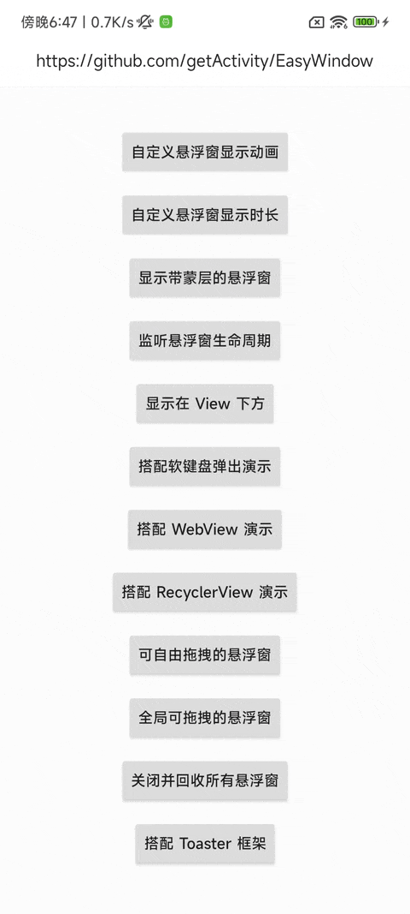

# 悬浮窗框架

* 项目地址：[Github](https://github.com/getActivity/EasyWindow)

* 博客地址：[悬浮窗需求终结者](https://www.jianshu.com/p/247d705b87b6)

* 可以扫码下载 Demo 进行演示或者测试，如果扫码下载不了的，[点击此处可直接下载](https://github.com/getActivity/EasyWindow/releases/download/11.2/EasyWindow.apk)




#### 本框架意在解决一些悬浮窗的需求，如果是普通的 Toast 封装推荐使用 [Toaster](https://github.com/getActivity/Toaster)

#### 集成步骤

* 如果你的项目 Gradle 配置是在 `7.0 以下`，需要在 `build.gradle` 文件中加入

```groovy
allprojects {
    repositories {
        // JitPack 远程仓库：https://jitpack.io
        maven { url 'https://jitpack.io' }
    }
}
```

* 如果你的 Gradle 配置是 `7.0 及以上`，则需要在 `settings.gradle` 文件中加入

```groovy
dependencyResolutionManagement {
    repositories {
        // JitPack 远程仓库：https://jitpack.io
        maven { url 'https://jitpack.io' }
    }
}
```

* 配置完远程仓库后，在项目 app 模块下的 `build.gradle` 文件中加入远程依赖

```groovy
android {
    // 支持 JDK 1.8
    compileOptions {
        targetCompatibility JavaVersion.VERSION_1_8
        sourceCompatibility JavaVersion.VERSION_1_8
    }
}

dependencies {
    // 悬浮窗框架：https://github.com/getActivity/EasyWindow
    implementation 'com.github.getActivity:EasyWindow:11.2'
}
```

#### 使用案例

* Java 用法

```java
// 传入 Activity 对象表示设置成局部的，不需要有悬浮窗权限
// 传入 Application 对象表示设置成全局的，但需要有悬浮窗权限
EasyWindow.with(this)
        .setContentView(R.layout.toast_hint)
        // 设置成可拖拽的
        //.setDraggable()
        // 设置显示时长
        .setDuration(1000)
        // 设置动画样式
        //.setAnimStyle(android.R.style.Animation_Translucent)
        // 设置外层是否能被触摸
        //.setOutsideTouchable(false)
        // 设置窗口背景阴影强度
        //.setBackgroundDimAmount(0.5f)
        .setImageDrawable(android.R.id.icon, R.mipmap.ic_dialog_tip_finish)
        .setText(android.R.id.message, "点我消失")
        .setOnClickListener(android.R.id.message, new EasyWindow.OnClickListener<TextView>() {

            @Override
            public void onClick(EasyWindow<?> easyWindow, TextView view) {
                // 点击这个 View 后消失
                easyWindow.cancel();
                // 跳转到某个Activity
                // easyWindow.startActivity(intent);
            }
        })
        .show();
```

* Kotlin 用法（二选一）

```kotlin
EasyWindow.with(activity).apply {
    setContentView(R.layout.toast_hint)
    // 设置成可拖拽的
    //setDraggable()
    // 设置显示时长
    setDuration(1000)
    // 设置动画样式
    //setAnimStyle(android.R.style.Animation_Translucent)
    // 设置外层是否能被触摸
    //setOutsideTouchable(false)
    // 设置窗口背景阴影强度
    //setBackgroundDimAmount(0.5f)
    setImageDrawable(android.R.id.icon, R.mipmap.ic_dialog_tip_finish)
    setText(android.R.id.message, "点我消失")
    setOnClickListener(android.R.id.message, EasyWindow.OnClickListener<TextView?> { easyWindow: EasyWindow<*>, view: TextView? ->
        // 点击这个 View 后消失
        easyWindow.cancel()
        // 跳转到某个Activity
        // easyWindow.startActivity(intent);
    })
}.show()
```

```kotlin
EasyWindow.with(activity)
        .setContentView(R.layout.toast_hint)
        // 设置成可拖拽的
        //.setDraggable()
        // 设置显示时长
        .setDuration(1000)
        // 设置动画样式
        //.setAnimStyle(android.R.style.Animation_Translucent)
        // 设置外层是否能被触摸
        //.setOutsideTouchable(false)
        // 设置窗口背景阴影强度
        //.setBackgroundDimAmount(0.5f)
        .setImageDrawable(android.R.id.icon, R.mipmap.ic_dialog_tip_finish)
        .setText(android.R.id.message, "点我消失")
        .setOnClickListener(android.R.id.message, EasyWindow.OnClickListener<TextView?> { easyWindow: EasyWindow<*>, view: TextView? ->
            // 点击这个 View 后消失
            easyWindow.cancel()
            // 跳转到某个Activity
            // easyWindow.startActivity(intent);
        })
        .show()
```

#### 没有悬浮窗权限如何全局显示？

* 没有悬浮窗权限是不能全局显示在其他应用上的，但是全局显示在自己的应用上是可以实现的

* 但是当前 Activity 创建的悬浮窗只能在当前 Activity 上面显示，如果想在所有的 Activity 都显示需要做特殊处理

* 我们可以通过 Application 来监听所有 Activity 的生命周期方法，然后在每个 Activity.onCreate 时创建悬浮窗

```java
public final class ActivityWindowLifecycle implements Application.ActivityLifecycleCallbacks {

    static void with(Application application) {
        application.registerActivityLifecycleCallbacks(new FloatingLifecycle());
    }

    @Override
    public void onActivityCreated(Activity activity, Bundle savedInstanceState) {
        EasyWindow.with(activity)
                .setView(R.layout.xxx)
                .show();
    }

    @Override
    public void onActivityStarted(Activity activity) {}

    @Override
    public void onActivityResumed(Activity activity) {}

    @Override
    public void onActivityPaused(Activity activity) {}

    @Override
    public void onActivityStopped(Activity activity) {}

    @Override
    public void onActivitySaveInstanceState(Activity activity, Bundle outState) {}

    @Override
    public void onActivityDestroyed(Activity activity) {}
}
```

#### 框架的 API 介绍

* 对象方法

```java
// 设置悬浮窗宽度
setWidth(int width)
// 设置悬浮窗高度
setHeight(int height)

// 设置悬浮窗显示的重心
setGravity(int gravity)
// 设置水平偏移量
setXOffset(int px)
// 设置垂直偏移量
setYOffset(int px)

// 设置悬浮窗外层是否可触摸
setOutsideTouchable(boolean touchable)
// 设置悬浮窗背景阴影强度
setBackgroundDimAmount(float amount)

// 添加窗口标记
addWindowFlags(int flags)
// 移除窗口标记
removeWindowFlags(int flags)
// 设置窗口标记
setWindowFlags(int flags)
// 是否存在某个窗口标记
hasWindowFlags(int flags)

// 设置悬浮窗的显示类型
setWindowType(int type)

// 几乎涵盖了所有 WindowManager 的参数
// 更多 API 方法请查看 EasyWindow 类的源码
......
```

* 静态方法

```java
// 取消所有正在显示的悬浮窗
EasyWindow.cancelAllWindow()

// 取消特定类名的悬浮窗
EasyWindow.cancelWindowByClass(Class<? extends EasyWindow<?>> clazz)

// 取消特定标记的悬浮窗
EasyWindow.cancelWindowByTag(String tag)

// 显示所有已取消但未回收的悬浮窗
EasyWindow.showAllWindow()

// 显示特定类名已取消但未回收的悬浮窗
EasyWindow.showWindowByClass(Class<? extends EasyWindow<?>> clazz)

// 显示特定标记已取消但未回收的悬浮窗
EasyWindow.showWindowByTag(String tag)

// 回收所有正在显示的悬浮窗
EasyWindow.recycleAllWindow()

// 回收特定类名的悬浮窗
EasyWindow.recycleWindowByClass(Class<? extends EasyWindow<?>> clazz)

// 回收特定标记的悬浮窗
EasyWindow.recycleWindowByTag(String tag)

// 判断当前是否有悬浮窗正在显示
EasyWindow.existAnyWindowShowing()

// 判断当前是否有特定类名的悬浮窗正在显示
EasyWindow.existWindowShowingByClass(Class<? extends EasyWindow<?>> clazz)

// 判断当前是否有特定标记的悬浮窗正在显示
EasyWindow.existWindowShowingByTag(String tag)

// 获取所有的悬浮窗
EasyWindow.getAllWindowInstance()

// 获取特定类名的悬浮窗
EasyWindow.getWindowInstanceByClass(Class<? extends EasyWindow<?>> clazz)

// 获取特定标记的悬浮窗
EasyWindow.getWindowInstanceByTag(String tag)
```

#### 框架混淆规则

* 在混淆规则文件 `proguard-rules.pro` 中加入

```text
-keep class com.hjq.window.** {*;}
```

#### 作者的其他开源项目

* 安卓技术中台：[AndroidProject](https://github.com/getActivity/AndroidProject)  

* 安卓技术中台 Kt 版：[AndroidProject-Kotlin](https://github.com/getActivity/AndroidProject-Kotlin)  

* 权限框架：[XXPermissions](https://github.com/getActivity/XXPermissions)  

* 吐司框架：[Toaster](https://github.com/getActivity/Toaster)  

* 网络框架：[EasyHttp](https://github.com/getActivity/EasyHttp)  

* 标题栏框架：[TitleBar](https://github.com/getActivity/TitleBar)  

* ShapeView 框架：[ShapeView](https://github.com/getActivity/ShapeView)  

* ShapeDrawable 框架：[ShapeDrawable](https://github.com/getActivity/ShapeDrawable)  

* 语种切换框架：[MultiLanguages](https://github.com/getActivity/MultiLanguages)  

* Gson 解析容错：[GsonFactory](https://github.com/getActivity/GsonFactory)  

* 日志查看框架：[Logcat](https://github.com/getActivity/Logcat)  

* 嵌套滚动布局框架：[NestedScrollLayout](https://github.com/getActivity/NestedScrollLayout)  

* Android 版本适配：[AndroidVersionAdapter](https://github.com/getActivity/AndroidVersionAdapter)  

* Android 代码规范：[AndroidCodeStandard](https://github.com/getActivity/AndroidCodeStandard)  

* Android 资源大汇总：[AndroidIndex](https://github.com/getActivity/AndroidIndex)  

* Android 开源排行榜：[AndroidGithubBoss](https://github.com/getActivity/AndroidGithubBoss)  

* Studio 精品插件：[StudioPlugins](https://github.com/getActivity/StudioPlugins)  

* 表情包大集合：[EmojiPackage](https://github.com/getActivity/EmojiPackage)  

* AI 资源大汇总：[AiIndex](https://github.com/getActivity/AiIndex)  

* 省市区 Json 数据：[ProvinceJson](https://github.com/getActivity/ProvinceJson)  

* Markdown 语法文档：[MarkdownDoc](https://github.com/getActivity/MarkdownDoc)  

#### 微信公众号：Android轮子哥


#### Android 技术 Q 群：10047167

#### 如果您觉得我的开源库帮你节省了大量的开发时间，请扫描下方的二维码随意打赏，要是能打赏个 10.24 :monkey_face:就太:thumbsup:了。您的支持将鼓励我继续创作:octocat:（[点击查看捐赠列表](https://github.com/getActivity/Donate)）

 

## License

```text
Copyright 2019 Huang JinQun

Licensed under the Apache License, Version 2.0 (the "License");
you may not use this file except in compliance with the License.
You may obtain a copy of the License at

   http://www.apache.org/licenses/LICENSE-2.0

Unless required by applicable law or agreed to in writing, software
distributed under the License is distributed on an "AS IS" BASIS,
WITHOUT WARRANTIES OR CONDITIONS OF ANY KIND, either express or implied.
See the License for the specific language governing permissions and
limitations under the License.
```