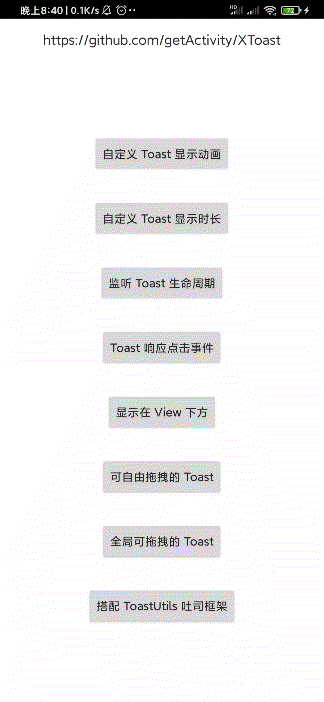

# 悬浮窗框架

* 项目地址：[Github](https://github.com/getActivity/XToast)、[码云](https://gitee.com/getActivity/XToast)

* 博客地址：[悬浮窗需求终结者](https://www.jianshu.com/p/247d705b87b6)

* 已投入公司项目多时，没有任何毛病，可胜任任何需求，[点击此处下载Demo](XToast.apk)



#### 本框架意在解决一些极端需求，如果是普通的 Toast 封装推荐使用 [ToastUtils](https://github.com/getActivity/ToastUtils)

#### 集成步骤

* 在项目根目录下的 `build.gradle` 文件中加入

```groovy
buildscript {
    repositories {
        maven { url 'https://jitpack.io' }
    }
}
allprojects {
    repositories {
        maven { url 'https://jitpack.io' }
    }
}
```

* 在项目 app 模块下的 `build.gradle` 文件中加入

```groovy
dependencies {
    // 悬浮窗框架：https://github.com/getActivity/XToast
    implementation 'com.github.getActivity:XToast:8.1'
}
```

#### 使用案例

* Java 用法

```java
// 传入 Activity 对象表示设置成局部的，不需要有悬浮窗权限
// 传入 Application 对象表示设置成全局的，但需要有悬浮窗权限
new XToast<>(XToastActivity.this)
        .setView(R.layout.toast_hint)
        // 设置成可拖拽的
        //.setDraggable()
        // 设置显示时长
        .setDuration(1000)
        // 设置动画样式
        //.setAnimStyle(android.R.style.Animation_Translucent)
        // 设置外层是否能被触摸
        //.setOutsideTouchable(false)
        // 设置窗口背景阴影强度
        //.setBackgroundDimAmount(0.5f)
        .setImageDrawable(android.R.id.icon, R.mipmap.ic_dialog_tip_finish)
        .setText(android.R.id.message, "点我消失")
        .setOnClickListener(android.R.id.message, new XToast.OnClickListener<TextView>() {

            @Override
            public void onClick(XToast toast, TextView view) {
                // 点击这个 View 后消失
                toast.cancel();
                // 跳转到某个Activity
                // toast.startActivity(intent);
            }
        })
        .show();
```

* Kotlin 用法（二选一）

```kotlin
XToast<XToast<*>>(activity).apply {
    setView(R.layout.toast_hint)
    // 设置成可拖拽的
    //setDraggable()
    // 设置显示时长
    setDuration(1000)
    // 设置动画样式
    //setAnimStyle(android.R.style.Animation_Translucent)
    // 设置外层是否能被触摸
    //setOutsideTouchable(false)
    // 设置窗口背景阴影强度
    //setBackgroundDimAmount(0.5f)
    setImageDrawable(android.R.id.icon, R.mipmap.ic_dialog_tip_finish)
    setText(android.R.id.message, "点我消失")
    setOnClickListener(android.R.id.message, XToast.OnClickListener<TextView?> { toast: XToast<*>, view: TextView? ->
        // 点击这个 View 后消失
        toast.cancel()
        // 跳转到某个Activity
        // toast.startActivity(intent);
    })
}.show()
```

```kotlin
XToast<XToast<*>>(activity)
        .setView(R.layout.toast_hint)
        // 设置成可拖拽的
        //.setDraggable()
        // 设置显示时长
        .setDuration(1000)
        // 设置动画样式
        //.setAnimStyle(android.R.style.Animation_Translucent)
        // 设置外层是否能被触摸
        //.setOutsideTouchable(false)
        // 设置窗口背景阴影强度
        //.setBackgroundDimAmount(0.5f)
        .setImageDrawable(android.R.id.icon, R.mipmap.ic_dialog_tip_finish)
        .setText(android.R.id.message, "点我消失")
        .setOnClickListener(android.R.id.message, XToast.OnClickListener<TextView?> { toast: XToast<*>, view: TextView? ->
            // 点击这个 View 后消失
            toast.cancel()
            // 跳转到某个Activity
            // toast.startActivity(intent);
        })
        .show()
```

#### 没有悬浮窗权限如何全局显示？

* 没有悬浮窗权限是不能全局显示在其他应用上的，但是全局显示在自己的应用上是可以实现的

* 但是当前 Activity 创建的悬浮窗只能在当前 Activity 上面显示，如果想在所有的 Activity 都显示需要做特殊处理

* 我们可以通过 Application 来监听所有 Activity 的生命周期方法，然后在每个 Activity.onCreate 时创建悬浮窗

```java
public final class FloatingLifecycle implements Application.ActivityLifecycleCallbacks {

    static void with(Application application) {
        application.registerActivityLifecycleCallbacks(new FloatingLifecycle());
    }

    @Override
    public void onActivityCreated(Activity activity, Bundle savedInstanceState) {
        new XToast<>(activity)
                .setXxx()
                .show();
    }

    @Override
    public void onActivityStarted(Activity activity) {}

    @Override
    public void onActivityResumed(Activity activity) {}

    @Override
    public void onActivityPaused(Activity activity) {}

    @Override
    public void onActivityStopped(Activity activity) {}

    @Override
    public void onActivitySaveInstanceState(Activity activity, Bundle outState) {}

    @Override
    public void onActivityDestroyed(Activity activity) {}
}
```

#### 框架亮点（原生 Toast 无法实现的功能）

* 支持自定义 Toast 动画样式

* 支持自定义 Toast 显示时长

* 支持监听 Toast 的显示和销毁

* 支持监听 Toast 中点击事件

* 支持一键开启 Toast 拖拽功能

* 支持 Toast 全局显示

#### 作者的其他开源项目

* 安卓技术中台：[AndroidProject](https://github.com/getActivity/AndroidProject)

* 网络框架：[EasyHttp](https://github.com/getActivity/EasyHttp)

* 权限框架：[XXPermissions](https://github.com/getActivity/XXPermissions)

* 吐司框架：[ToastUtils](https://github.com/getActivity/ToastUtils)

* 标题栏框架：[TitleBar](https://github.com/getActivity/TitleBar)

* 国际化框架：[MultiLanguages](https://github.com/getActivity/MultiLanguages)

* Gson 解析容错：[GsonFactory](https://github.com/getActivity/GsonFactory)

* 日志查看框架：[Logcat](https://github.com/getActivity/Logcat)

#### 微信公众号：Android轮子哥


#### Android 技术分享 QQ 群：78797078

#### 如果您觉得我的开源库帮你节省了大量的开发时间，请扫描下方的二维码随意打赏，要是能打赏个 10.24 :monkey_face:就太:thumbsup:了。您的支持将鼓励我继续创作:octocat:

 

#### [点击查看捐赠列表](https://github.com/getActivity/Donate)

## License

```text
Copyright 2019 Huang JinQun

Licensed under the Apache License, Version 2.0 (the "License");
you may not use this file except in compliance with the License.
You may obtain a copy of the License at

   http://www.apache.org/licenses/LICENSE-2.0

Unless required by applicable law or agreed to in writing, software
distributed under the License is distributed on an "AS IS" BASIS,
WITHOUT WARRANTIES OR CONDITIONS OF ANY KIND, either express or implied.
See the License for the specific language governing permissions and
limitations under the License.
```